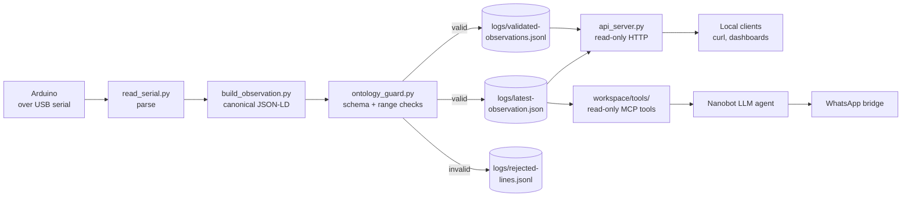
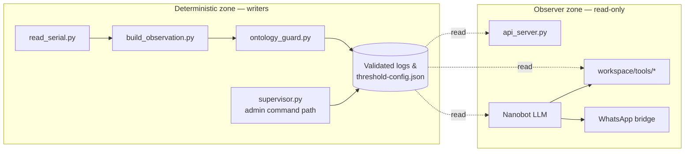
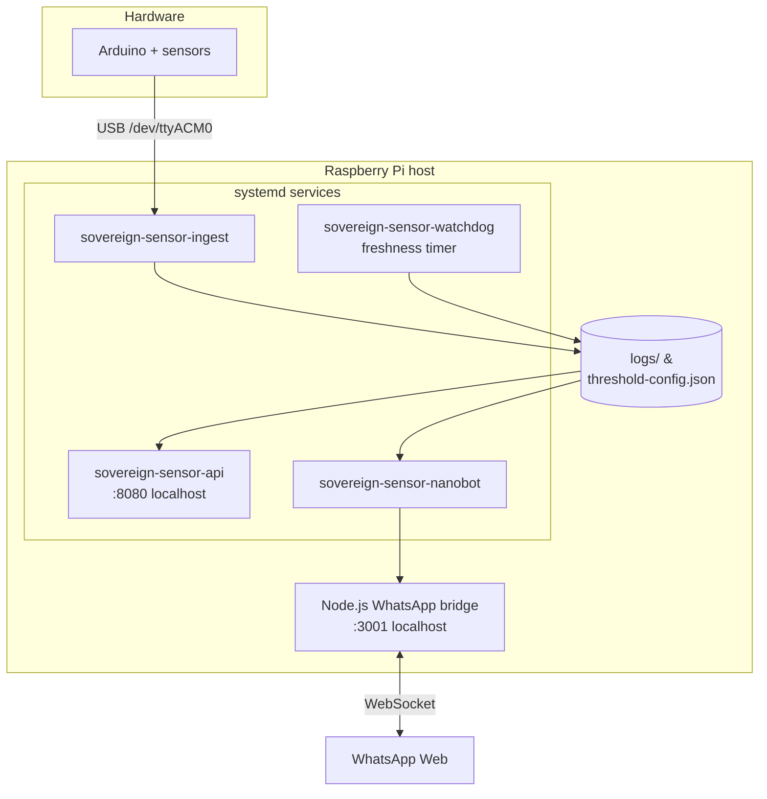

# Sovereign Sensor Agent

Deterministic Arduino sensor ingestion and read-only local agent interface for temperature, humidity, and optional pressure.

This repository is designed around a strict boundary: the Arduino and Python pipeline are the source of truth, while any LLM or chat interface is limited to reading validated local data. The project is intended for local-first deployments such as a Raspberry Pi connected to an Arduino over serial, with an optional messaging layer on top.

Nanobot-specific runtime, service, and command setup is documented in `OPERATIONS.md`.

## Overview

The system performs five distinct jobs:

1. Read serial sensor lines from an Arduino.
2. Convert those lines into a canonical JSON-LD observation.
3. Validate the observation against a JSON Schema and additional runtime checks.
4. Persist validated data to local logs and expose a read-only API.
5. Allow a constrained chat layer to answer questions using validated local files only.

This architecture is intentionally conservative. The LLM does not generate canonical observations, does not write to storage, and does not read directly from the serial port.

## Demo

> All screenshots live in [`docs/images/`](./docs/images/). Drop the captured
> files in that directory using the filenames below.

### Hardware


### WhatsApp interaction

| Live sensor query | Threshold alarm | Admin command |
|---|---|---|
|  |  |  |

### Local API & operations

| Latest observation | Service health | Validation rejection log |
|---|---|---|
|  |  |  |

## Use Cases

- Local environmental monitoring on a Raspberry Pi connected to an Arduino.
- Read-only sensor queries from a local dashboard or automation layer.
- Controlled WhatsApp or chatbot integration that can answer questions like "What is the temperature?"
- Research or prototyping of trustworthy LLM patterns where deterministic code remains the source of truth.
- Building a traceable ingestion pipeline with explicit schema validation and rejection logging.

## Current Capabilities

- Serial ingestion from `/dev/ttyACM*` or `/dev/ttyUSB*` devices.
- Parsing of deterministic Arduino lines in the form `TEMP=...;HUM=...;TS=...` with optional `PRESS=...`.
- Parsing of human-readable Arduino output blocks such as `Temperature = ...` and `Humidity = ...`.
- Canonical JSON-LD observation generation.
- Schema validation and additional range and timestamp checks.
- Append-only validated observation log.
- Latest observation snapshot file.
- Rejected line log with structured error events.
- Read-only HTTP API for latest observations and individual metrics.
- Minimal local webhook endpoint for chat or WhatsApp-provider integration.
- Local read-only tools for agent use.
- Test coverage for ingestion, validation, supervisor logic, API endpoints, and webhook behavior.

## What This Repo Is Not

- Not a hosted WhatsApp bot by itself.
- Not a write-capable automation agent.
- Not a system that lets an LLM bypass validation or serial ingestion.
- Not yet a full production deployment package with service files, auth, observability, and public ingress.

## Architecture

The project has one rule that explains every other design choice: **the
Python pipeline is the only thing that writes**. The LLM, the HTTP API, and
the WhatsApp bridge are all observers — they read from validated local files
and never reach back into the serial port, the schemas, or the logs.

### Data flow



### Trust boundary

The deterministic zone owns all writes. The observer zone — including any
LLM — can only read validated files through narrow, audited interfaces.



Anything the LLM "wants" to write becomes an intent proposal object, gated
by `supervisor.py` and `SSA_ADMIN_PASSWORD`. The schema in
`schemas/agent-action-v1.json` enumerates the only intents an LLM may emit.

### Deployment topology

A typical Raspberry Pi deployment runs three systemd services plus an
optional WhatsApp bridge. The Arduino is wired to the Pi over USB serial.



### Deterministic Pipeline

- `scripts/read_serial.py`
  Reads from a serial device or stdin, parses sensor lines, validates them, writes validated records, updates the latest snapshot, and logs rejected input.

- `scripts/build_observation.py`
  Converts a raw parsed payload into the canonical JSON-LD observation shape.

- `scripts/ontology_guard.py`
  Enforces the schema contract plus runtime checks such as canonical UTC timestamps and safe value ranges.

- `logs/validated-observations.jsonl`
  Append-only validated observation history.

- `logs/latest-observation.json`
  Latest validated observation snapshot for fast reads.

- `logs/rejected-lines.jsonl`
  Structured record of rejected serial lines and validation failures.

### Read-Only Access Layer

- `scripts/api_server.py`
  Exposes a local HTTP API and a minimal webhook endpoint.

- `scripts/supervisor.py`
  Deterministic read-only command handler for latest values and threshold status.

- `threshold-config.json`
  Persistent threshold state used by the API, supervisor, and WhatsApp admin command path when present.

- `workspace/tools/get_latest_observation.py`
  Returns the latest validated observation.

- `workspace/tools/get_metric.py`
  Returns a single validated metric: temperature, humidity, or pressure when present.

- `workspace/tools/get_threshold_status.py`
  Returns threshold status for temperature, humidity, and pressure, marking missing metrics as unavailable.

### LLM Constraint Layer

- `workspace/POLICY.md`
  Defines the enforcement rules for LLM behavior.

- `workspace/WHATSAPP_SYSTEM_PROMPT.md`
  Defines how a WhatsApp-facing assistant should behave using only read-only local tools.

- `schemas/agent-action-v1.json`
  Contract for constrained agent intents.

- `schemas/sensor-observation-v1.json`
  Contract for canonical sensor observations.

## Repository Structure

```text
.
├── arduino/
│   └── sense-rev2/             # Reference Arduino sketch + wiring notes
├── deploy/
│   ├── nanobot/                # Nanobot/MCP/WhatsApp glue
│   └── systemd/                # Systemd unit templates
├── logs/                       # Runtime data (git-ignored)
├── schemas/
│   ├── agent-action-v1.json
│   └── sensor-observation-v1.json
├── scripts/                    # Deterministic Python pipeline
│   ├── api_server.py
│   ├── build_observation.py
│   ├── ontology_guard.py
│   ├── read_serial.py
│   ├── supervisor.py
│   ├── test_pipeline.py
│   └── test_supervisor.py
└── workspace/                  # LLM-facing read-only boundary
    ├── POLICY.md
    ├── WHATSAPP_SYSTEM_PROMPT.md
    └── tools/
        ├── get_latest_observation.py
        ├── get_metric.py
        └── get_threshold_status.py
```

## Requirements

- Linux environment, typically Raspberry Pi OS.
- Python 3.11 or compatible Python 3 runtime.
- An Arduino or compatible device connected over serial.
- Serial access permissions for the active user.
- Python dependency: `jsonschema`.

## Setup

### 1. Create and activate a virtual environment

```bash
cd ~/sovereign-sensor-agent
python3 -m venv .venv
source .venv/bin/activate
pip install -r requirements.txt
```

### 2. Confirm the Arduino serial device exists

```bash
ls -l /dev/ttyACM* /dev/ttyUSB* 2>/dev/null
```

On the current Raspberry Pi environment, `/dev/ttyACM0` is present.

### 3. Confirm serial permissions

The active user should generally be in the `dialout` group.

```bash
groups
```

## Expected Arduino Serial Format

The ingestion script accepts either a canonical single-line format or a simple human-readable multi-line format.

Canonical format with optional pressure:

```text
TEMP=23.4;HUM=51.2;TS=2026-03-29T11:12:13Z
TEMP=23.4;HUM=51.2;PRESS=1008.7;TS=2026-03-29T11:12:13Z
```

Human-readable format:

```text
Temperature = 19.95 °C
Humidity    = 37.28 %
```

Rules:

- `TEMP`, `HUM`, and `TS` are required in canonical format.
- `PRESS` is optional.
- Human-readable blocks must include temperature and humidity. Pressure may be omitted.
- Duplicate fields are rejected.
- Extra fields are rejected.
- Values must be numeric where required.
- The final observation must pass schema and range validation.

## How To Run

### Ingest live Arduino data

From the repository root:

```bash
cd ~/sovereign-sensor-agent
./.venv/bin/python scripts/read_serial.py --device /dev/ttyACM0 --baud 9600 --sensor-id arduino-ttyACM0
```

From inside `scripts/`:

```bash
cd ~/sovereign-sensor-agent/scripts
python read_serial.py --device /dev/ttyACM0 --baud 9600 --sensor-id arduino-ttyACM0
```

If your board appears under a different path, replace `/dev/ttyACM0` accordingly.

### Test ingestion from stdin

```bash
cd ~/sovereign-sensor-agent
printf 'TEMP=23.4;HUM=51.2;PRESS=1008.7;TS=2026-03-29T11:12:13Z\n' \
  | ./.venv/bin/python scripts/read_serial.py --stdin --max-lines 1
```

This also works without pressure:

```bash
cd ~/sovereign-sensor-agent
printf 'TEMP=23.4;HUM=51.2;TS=2026-03-29T11:12:13Z\n' \
  | ./.venv/bin/python scripts/read_serial.py --stdin --max-lines 1
```

### Start the read-only API and webhook

From the repository root:

```bash
cd ~/sovereign-sensor-agent
./.venv/bin/python scripts/api_server.py --host 0.0.0.0 --port 8080
```

From inside `scripts/`:

```bash
cd ~/sovereign-sensor-agent/scripts
python api_server.py --host 0.0.0.0 --port 8080
```

Important:

- Use `python3` or `./.venv/bin/python`.
- Do not use `.python`; that command does not exist.

### Query the API locally

```bash
curl -s http://127.0.0.1:8080/
curl -s http://127.0.0.1:8080/health
curl -s http://127.0.0.1:8080/latest
curl -s http://127.0.0.1:8080/latest/temp
curl -s http://127.0.0.1:8080/latest/humidity
curl -s http://127.0.0.1:8080/latest/pressure
curl -s http://127.0.0.1:8080/latest/threshold-status
```

### Query the deterministic supervisor

```bash
cd ~/sovereign-sensor-agent
./.venv/bin/python scripts/supervisor.py read_latest temperature
./.venv/bin/python scripts/supervisor.py read_latest humidity
./.venv/bin/python scripts/supervisor.py read_latest pressure
./.venv/bin/python scripts/supervisor.py get_threshold_status
```

### Query the local read-only tool wrappers

```bash
cd ~/sovereign-sensor-agent
./.venv/bin/python workspace/tools/get_latest_observation.py
./.venv/bin/python workspace/tools/get_metric.py temperature
./.venv/bin/python workspace/tools/get_metric.py pressure
./.venv/bin/python workspace/tools/get_threshold_status.py
```

If the connected device does not emit pressure, the pressure command returns an unavailable error while temperature and humidity remain live.

### Verify the Nanobot tool layer

This verifies the MCP shim exposes only the intended read-only tools and that those tools read validated local files.

```bash
cd ~/sovereign-sensor-agent
./.venv/bin/python deploy/nanobot/test_tool_layer.py
```

Expected result:

- Tool names include `get_latest_observation`, `get_metric`, and `get_threshold_status`.
- Temperature and humidity queries return `ok: true` payloads.
- Pressure returns a value when the sensor provides it, otherwise it reports unavailable.
- The tool layer reads from the validated wrappers in `workspace/tools/`.

### Ask the Nanobot agent local sensor questions

This step requires `GEMINI_API_KEY` in `deploy/nanobot/nanobot.env`.

```bash
cd ~/sovereign-sensor-agent
cp deploy/nanobot/nanobot.env.example deploy/nanobot/nanobot.env
./deploy/nanobot/start_nanobot.sh agent --message "What is the current temperature?"
./deploy/nanobot/start_nanobot.sh agent --message "What is the current humidity?"
./deploy/nanobot/start_nanobot.sh agent --message "What is the current pressure?"
./deploy/nanobot/start_nanobot.sh agent --message "What is the threshold status?"
```

Or run the smoke-test script:

```bash
cd ~/sovereign-sensor-agent
./deploy/nanobot/test_agent_answers.sh
```

The Nanobot deployment is intentionally constrained:

- It answers sensor questions through the read-only MCP tools only.
- It does not read `/dev/tty*` directly.
- It runs in the isolated workspace under `deploy/nanobot/workspace`.

## API Reference

### `GET /`

Returns a small service summary with the API status and a list of available endpoints. This is useful when opening the API in a browser.

### `GET /health`

Returns API readiness and observation freshness.

```json
{
  "ok": true,
  "status": "ready",
  "latestObservationAvailable": true,
  "lastObservationAt": "2026-04-01T10:00:00Z",
  "freshnessAgeSeconds": 42,
  "isFresh": true
}
```

`status` is `"ready"` when data is under 5 minutes old, `"stale"` when older, and `"waiting_for_data"` when no observation file exists yet.

### `GET /latest`

Returns the full latest validated observation.

### `GET /latest/temp`

Returns the latest validated temperature.

### `GET /latest/humidity`

Returns the latest validated humidity.

### `GET /latest/pressure`

Returns the latest validated pressure when the sensor provides it. If pressure is absent from the latest observation, the endpoint returns an unavailable error.

### `GET /latest/threshold-status`

Returns threshold evaluations for temperature, humidity, and pressure. Missing metrics are reported as `unavailable` instead of failing the whole response.

### `GET /config/thresholds`

Returns the currently active threshold configuration, including any password-protected updates that were saved from WhatsApp or the webhook.

### `POST /webhook`

Minimal local chat endpoint intended for provider integration.

Supported request styles:

- `application/json`
- `application/x-www-form-urlencoded`

Examples:

```bash
curl -s -X POST http://127.0.0.1:8080/webhook \
  -H 'Content-Type: application/json' \
  -d '{"text":"what is the temperature?"}'
```

```bash
curl -s -X POST http://127.0.0.1:8080/webhook \
  -H 'Content-Type: application/x-www-form-urlencoded' \
  -d 'Body=what is the pressure?'
```

Typical supported questions:

- temperature
- humidity
- pressure, when the sensor provides it
- threshold status

Administrative threshold commands are also supported through the same webhook path. These commands are deterministic and do not go through the LLM layer.

Examples:

```bash
curl -s -X POST http://127.0.0.1:8080/webhook \
  -H 'Content-Type: application/json' \
  -d '{"text":"<admin-password> thresholds"}'
```

```bash
curl -s -X POST http://127.0.0.1:8080/webhook \
  -H 'Content-Type: application/json' \
  -d '{"text":"<admin-password> set temp 30"}'
```

```bash
curl -s -X POST http://127.0.0.1:8080/webhook \
  -H 'Content-Type: application/json' \
  -d '{"text":"<admin-password> set temp critical 35"}'
```

## Logs and Data Files

### `logs/validated-observations.jsonl`

- Append-only history of validated observations.
- Good for auditing, replay, and downstream summaries.

### `logs/latest-observation.json`

- Most recent validated observation.
- Fast path for HTTP API and local tool access.

### `logs/rejected-lines.jsonl`

- Structured diagnostics for malformed or invalid serial lines.
- Useful when debugging Arduino output formatting or sensor anomalies.

## Validation and Safety Model

This project intentionally separates deterministic logic from LLM behavior.

Key rules:

- Canonical observations are created only by Python control logic.
- All live answers must come from validated local files.
- The LLM must never read directly from `/dev/tty*` devices.
- The LLM must never write to logs, schemas, or external repositories.
- Non-read-only actions must remain proposal-only.

This design makes the system easier to reason about, easier to audit, and safer to expose through a messaging interface.

## Testing

Run the test suite with:

```bash
cd ~/sovereign-sensor-agent
./.venv/bin/python scripts/test_pipeline.py
./.venv/bin/python scripts/test_supervisor.py
```

## Raspberry Pi Deployment With systemd

Service files for all four units are provided in `deploy/systemd/`. Install and enable them in one command:

```bash
./scripts/ssa install
```

This copies the service files to `/etc/systemd/system/`, runs `daemon-reload`, and enables the correct units at boot:

| Service | Boot behaviour |
|---------|---------------|
| `sovereign-sensor-ingest` | Enabled — starts automatically |
| `sovereign-sensor-api` | Enabled — starts automatically |
| `sovereign-sensor-watchdog.timer` | Enabled — freshness check every 5 min |
| `sovereign-sensor-nanobot` | **Not** enabled — start manually with `ssa up` |

### ssa command reference

`scripts/ssa` is the single entry point for all day-to-day operations.

```bash
ssa install              # first-time setup: copies service files, enables ingest+api+watchdog at boot
ssa up                   # start the Nanobot/WhatsApp stack
ssa down                 # stop the Nanobot/WhatsApp stack
ssa restart              # restart the Nanobot/WhatsApp stack
ssa status               # full systemd status for all three services

ssa health               # operational summary: service states, API freshness, watchdog result
ssa watchdog             # run a one-shot freshness check, writes logs/watchdog-status.json

ssa deploy               # upgrade: stop → git pull → pip install → systemd reload → restart
ssa rollback             # revert to the commit saved by the last ssa deploy
ssa backup [dir]         # archive logs/, threshold-config.json, WhatsApp auth state
ssa restore <file>       # restore from a backup tarball
ssa rotate               # archive older observations and thin mid-range history
ssa check                # run pre-flight environment checks manually

ssa login                # start WhatsApp QR-code login flow
ssa tasks-login          # run Google Tasks OAuth login flow
ssa bridge               # start the WhatsApp bridge process manually
ssa gateway              # start the Nanobot gateway without the full WhatsApp stack
```

### Inspect service status and logs

```bash
ssa status
ssa health
journalctl -u sovereign-sensor-ingest.service -f
journalctl -u sovereign-sensor-api.service -f
```

The current codebase has passing tests for:

- sensor line parsing
- observation construction
- schema and range validation
- rejection logging
- latest snapshot updates
- API metric endpoints
- webhook behavior
- supervisor responses
- optional pressure support across the stack

## WhatsApp Integration Status

What exists today:

- A constrained WhatsApp-oriented system prompt.
- Read-only local tool wrappers.
- A local webhook endpoint that a provider can call.
- A local Nanobot WhatsApp bridge flow for linking and testing on-device.

What does not exist yet:

- A public webhook URL.
- Twilio or Meta WhatsApp configuration in this repository.
- Authentication, signature verification, or production deployment hardening.

To connect a real provider, you still need to expose the local service through a tunnel, reverse proxy, or hosted deployment, then configure the provider to call `POST /webhook`.

## What You Can Ask via WhatsApp

This system is sensor-read-only, with optional Google Tasks actions. Sensor data stays read-only; task management runs through a separate Google Tasks MCP server.

**Messages must start with `@ssa` or the agent will stay silent.** This is intentional: any message that does not begin with `@ssa` is ignored.

### Supported queries

```
@ssa what is the temperature?
@ssa what is the humidity?
@ssa what is the pressure?
@ssa what is the threshold status?
@ssa summarize last 10 readings
@ssa summarize last 30 minutes
```

### Supported Google Tasks commands (when `NANOBOT_ENABLE_GOOGLE_TASKS=true`)

```
@ssa add task buy filters tomorrow 09:00
@ssa list tasks
@ssa complete task TASK_ID
```

### Admin threshold commands (password required)

```
@ssa <admin-password> thresholds
@ssa <admin-password> set temp 30
@ssa <admin-password> set temp critical 35
```

### What the agent cannot do

- Write to sensor logs or modify observations
- Control hardware or trigger actions on the Pi
- Answer questions about topics outside sensor data
- Perform arbitrary writes outside Google Tasks list/create/complete

If you ask for something outside the supported queries, the agent will either give the closest safe read-only answer or stay silent.

---

## WhatsApp Quick Start

The repository supports a local WhatsApp test path through Nanobot's WhatsApp Web bridge. This is separate from the bare `POST /webhook` endpoint and is the documented way to link a WhatsApp account on the Raspberry Pi.

### 1. Install prerequisites

- Python environment for this repository.
- Node.js 18 or newer.
- `npm` available on the Raspberry Pi.

### 2. Prepare the Nanobot environment file

```bash
cd ~/sovereign-sensor-agent
cp deploy/nanobot/nanobot.env.example deploy/nanobot/nanobot.env
```

Set these values in `deploy/nanobot/nanobot.env`:

```bash
GEMINI_API_KEY=REPLACE_WITH_YOUR_KEY
NANOBOT_ENABLE_WHATSAPP=true
NANOBOT_WHATSAPP_ALLOW_FROM=REPLACE_WITH_YOUR_WHATSAPP_ID
NANOBOT_WHATSAPP_ALLOW_SELF_MESSAGES=false
NANOBOT_WHATSAPP_SELF_CHAT_ONLY=false
NANOBOT_WHATSAPP_GROUP_POLICY=mention
NANOBOT_WHATSAPP_BRIDGE_URL=ws://localhost:3001
NANOBOT_WHATSAPP_BRIDGE_TOKEN=
SSA_ADMIN_PASSWORD=CHANGE_ME
SSA_WHATSAPP_ALERT_TO=REPLACE_WITH_YOUR_WHATSAPP_ID
NANOBOT_ENABLE_GOOGLE_TASKS=false
GOOGLE_TASKS_CLIENT_SECRET_FILE=
GOOGLE_TASKS_TOKEN_FILE=
GOOGLE_TASKS_OAUTH_PORT=8765
GOOGLE_CHAT_WEBHOOK_URL=
GOOGLE_CHAT_TIMEOUT_SECONDS=5
```

Guidance:

- `NANOBOT_WHATSAPP_ALLOW_FROM` should be an explicit allowlist, not `*`.
- Use the phone number or LID shown in gateway logs for the allowed contact.
- Set `NANOBOT_WHATSAPP_ALLOW_SELF_MESSAGES=true` if you want to test through the linked account's self-chat.
- Set `NANOBOT_WHATSAPP_SELF_CHAT_ONLY=true` if you want to deny all other chats during testing.
- `SSA_ADMIN_PASSWORD` defaults to the literal placeholder `CHANGE_ME`. Set it to a strong, unguessable token in `nanobot.env` before enabling the WhatsApp bridge; `scripts/check_env.py` warns when the value is still the default.
- `SSA_WHATSAPP_ALERT_TO` is the direct chat that receives automatic temperature alarm messages. It can match `NANOBOT_WHATSAPP_ALLOW_FROM`.
- Set `NANOBOT_ENABLE_GOOGLE_TASKS=true` to allow task commands from WhatsApp.
- Set `GOOGLE_TASKS_CLIENT_SECRET_FILE` to your local OAuth client JSON path, then run `ssa tasks-login`.
- `GOOGLE_CHAT_WEBHOOK_URL` is optional; when set, task create/complete events are posted to Google Chat.

### 3. Optional: complete Google Tasks OAuth

```bash
cd ~/sovereign-sensor-agent
ssa tasks-login
```

This opens a local OAuth flow and writes the token used by the Google Tasks MCP server.

### 4. Verify the read-only tool layer before linking WhatsApp

```bash
cd ~/sovereign-sensor-agent
./.venv/bin/python deploy/nanobot/test_tool_layer.py
```

Do this first so you know the agent can answer from validated sensor files before you add the messaging layer.

### 5. Link the WhatsApp account

```bash
cd ~/sovereign-sensor-agent
./deploy/nanobot/start_nanobot.sh whatsapp-login
```

Scan the QR code for WhatsApp Web. If you leave that process running after login, it already acts as the active bridge process.

### 6. Install the ssa command and systemd services

```bash
cd ~/sovereign-sensor-agent
./scripts/ssa install
```

This installs `/usr/local/bin/ssa`, copies all service and timer files to `/etc/systemd/system/`, and enables ingest, API, and the freshness watchdog timer at boot. See the [ssa command reference](#ssa-command-reference) for the full list of available commands.

### 7. Start the WhatsApp stack with one command

```bash
ssa up
```

That service now brings up the WhatsApp bridge, the deterministic admin-and-alert daemon, and the Nanobot gateway together.

### 8. Start the bridge manually only if you are troubleshooting

```bash
cd ~/sovereign-sensor-agent
./deploy/nanobot/start_nanobot.sh whatsapp-bridge
```

The bridge listens locally on `ws://127.0.0.1:3001`.

### 9. Administrative WhatsApp commands

Nanobot and the deterministic admin daemon now answer only to WhatsApp messages that start with `@ssa`.

Send one of these messages from an allowed WhatsApp chat:

- `@ssa <admin-password> thresholds`
- `@ssa <admin-password> set temp 30`
- `@ssa <admin-password> set temp critical 35`

Those commands update `threshold-config.json` directly. They do not go through the model.

Normal sensor questions and task commands must also start with `@ssa`, for example:

- `@ssa temperature`
- `@ssa what is the current humidity?`
- `@ssa what is the threshold status?`
- `@ssa add task change air filter tomorrow 09:00`
- `@ssa list tasks`

If the message does not start with `@ssa`, the deployment is expected to stay silent.

### 10. Automatic temperature alarm messages

When temperature crosses into the configured warning or critical state, the WhatsApp daemon sends an outbound message to `SSA_WHATSAPP_ALERT_TO`.

### 11. Start the Nanobot gateway manually if you do not want the systemd wrapper

In another terminal:

```bash
cd ~/sovereign-sensor-agent
./deploy/nanobot/start_nanobot.sh gateway
```

### 12. Test end to end

Send a WhatsApp message from an allowed sender such as:

- `@ssa what is the current temperature?`
- `@ssa what is the current humidity?`
- `@ssa what is the current pressure?`
- `@ssa what is the threshold status?`
- `@ssa add task buy replacement sensor cable`
- `@ssa list tasks`

Expected behavior:

- Nanobot answers briefly using the read-only sensor tools.
- Task commands are routed to Google Tasks when enabled and OAuth is configured.
- Replies come from validated local data, not from the serial device directly.
- Pressure may be reported as unavailable if the connected sensor does not emit it.
- Group chats remain quiet unless the linked account is mentioned when `NANOBOT_WHATSAPP_GROUP_POLICY=mention`.

Current default thresholds, unless `threshold-config.json` overrides them:

- Temperature warning: `28.0 C`
- Temperature critical: `35.0 C`
- Humidity warning: `70.0 %`
- Humidity critical: `85.0 %`
- Pressure warning band: `980.0` to `1035.0 hPa`
- Pressure critical band: `960.0` to `1060.0 hPa`

If WhatsApp replies with a message such as `unable to retrieve temperature, sensor timed out`, that means the Nanobot MCP call hit its timeout, not that the ingest pipeline necessarily failed. Check these first:

- `ssa status`
- `curl -s http://127.0.0.1:8080/latest/temp`
- `sudo journalctl -u sovereign-sensor-nanobot.service -n 50 --no-pager`

The runtime MCP tool timeout is configured in `deploy/nanobot/start_nanobot.sh` and is now set to 30 seconds.

If `gateway` logs `Connect call failed ('127.0.0.1', 3001)`, the WhatsApp bridge is not running yet.

## Professional Notes for GitHub

This project is worth pushing to GitHub, with a few caveats:

- It is already solid enough for a private repository.
- It can become a strong public portfolio project once repository hygiene is tightened.
- Generated logs and virtual environment files should not be treated as source-controlled artifacts.
- A `.gitignore`, deployment notes, and a short security section would improve publication quality.

Recommended publication approach:

1. Push it privately first.
2. Add provider-specific integration docs and final security hardening.
3. Decide later whether to make it public.

## Roadmap and Future Improvements

### Near-Term TODO

- Add webhook authentication and signature verification for real provider integrations.
- Add structured request logging for the webhook.
- Add a deployment guide for ngrok, cloudflared, or reverse proxy setup.

### Medium-Term TODO

- Add rolling summaries over the last `N` observations.
- Add retention or rotation policy for logs.
- Add richer threshold configuration with per-device overrides.
- Add integration tests that exercise ingest plus API in one end-to-end flow.

### Long-Term TODO

- Support multiple sensor devices and multiple named sources.
- Add authenticated dashboard or lightweight UI.
- Add provider adapters for Twilio or Meta WhatsApp.
- Add signed exports or downstream integrations while preserving the read-only LLM boundary.

## Troubleshooting

### `bash: .python: command not found`

Use one of these instead:

```bash
python3 scripts/api_server.py
./.venv/bin/python scripts/api_server.py
```

### No serial device found

Check:

```bash
ls -l /dev/ttyACM* /dev/ttyUSB* 2>/dev/null
```

If nothing appears, verify the USB cable, board power, and kernel detection.

### Permission denied on serial device

Check whether the user is in `dialout`:

```bash
groups
```

### API says latest observation is missing

Run the ingestion script first so validated data is written to `logs/latest-observation.json`.

### No reply from WhatsApp

Work through this checklist in order:

**1. Does the message start with `@ssa`?**
The agent silently ignores every message that does not begin with `@ssa`. This is by design.

```
@ssa temperature          ← answered
temperature               ← silently ignored
```

**2. Is Nanobot running?**
Nanobot is not started automatically. Start it manually:

```bash
ssa up
ssa status                # should show sovereign-sensor-nanobot active
```

**3. Is the WhatsApp bridge connected?**

```bash
ssa status
sudo journalctl -u sovereign-sensor-nanobot.service -n 50 --no-pager
```

If logs show `Connect call failed ('127.0.0.1', 3001)`, the bridge is not running. Start it:

```bash
ssa bridge
```

**4. Is your sender ID in the allowlist?**
Check `NANOBOT_WHATSAPP_ALLOW_FROM` in `deploy/nanobot/nanobot.env`. The value must match your WhatsApp ID exactly. The gateway logs print the sender ID on each incoming message.

**5. Is the ingest pipeline producing fresh data?**

```bash
ssa health
curl -s http://127.0.0.1:8080/health
```

If `status` is `stale` or `waiting_for_data`, the ingest service is not running or the Arduino is not connected. Start ingest:

```bash
sudo systemctl start sovereign-sensor-ingest.service
```

## Contributing

Bug reports, feature requests, and pull requests are welcome. See
[`CONTRIBUTING.md`](./CONTRIBUTING.md) for development setup, testing
guidelines, and the project's architectural invariants.

## Security

Please report vulnerabilities privately rather than via public issues. See
[`SECURITY.md`](./SECURITY.md) for the disclosure process and threat-model
notes.

## License

Licensed under the [Apache License, Version 2.0](./LICENSE).
